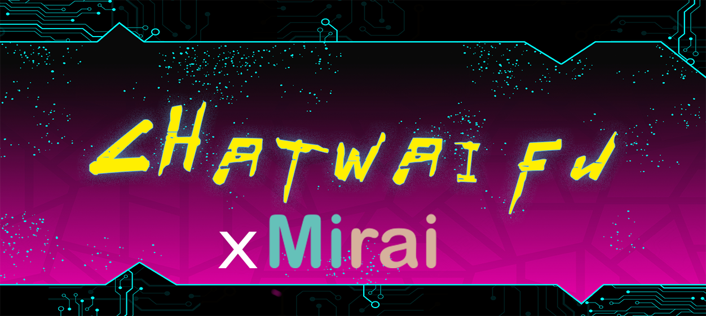
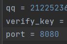

[中文](README.md "中文") [English](eng-README.md "English") [日本語](jp-README.md "日本語")

	
	
  	

#
### 这是一个使用TTS+VITS的ChatGPT语音对话程序!

**基于**:
 - [miraicle](https://github.com/Excaive/miraicle)
 - [mirai-http-api](https://github.com/project-mirai/mirai-api-http)
 - [ChatWaifu](https://github.com/cjyaddone/ChatWaifu)

效果演示BiliBIli:[《青春猪头少年不会梦见赛博女友》](https://www.bilibili.com/video/BV1rv4y1Q7eT "BiliBili")

**当前支持功能：**
* [x] ChatGPT的对话聊天
* [x] 回答转语音
* [x] 多角色语音
* [x] 语音识别对话 (研发了一款真正人性化的智能语音Q宝
* [x] 对接Marai机器人
* [x] [对接Live2D版本](https://github.com/cjyaddone/ChatWaifuL2D)

# 目录
* [1.安装环境：](#1.)
	* 1.1 [使用cd命令进入项目文件夹](#cd)
	* 1.2 [创建Python虚拟环境:](#99)
	* 1.3 [进入创建好的虚拟环境:](#venv)
	* 1.4 [pip安装项目所需要的库文件:](#pip)
* [2.导入模型到根目录model文件夹（如果没有自行创建):](#.model)
	* 2.1 [双击导入model](#cd1)
* [3.运行（快和我的老婆们对话吧:](#22)
	* 3.1 [获取marai verify_key和QQ](#343533)
	* 3.2 [获取ChatGPT Token](#333)
	* 3.3 [开始和CyberWaifu聊天](#444)
* [4.已知问题:](#9315)
* [5.鸣:谢](#915)
## 1.安装环境：
> **安装anaconda环境或Python>=3.7**
> 
> **本例使用的环境名称是：chatWaifu**

### 1.1 使用cd命令进入项目文件夹
`cd 你的项目路径`

### 1.2 创建Python虚拟环境:

Conda:`conda create --name chatWaifu python=3.10`

Python:`python -m venv chatWaifu`

### 1.3 进入创建好的虚拟环境:
Conda:`conda activate chatWaifu`

Python:`.\chatWaifu\Scripts\activate.bat`

### 1.4 pip安装项目所需要的库文件:
`pip install -r requirements.txt`

## 2.导入模型到根目录model文件夹:
Google Drive:https://drive.google.com/file/d/1tMCafhnUoL7FbevVQ44VQi-WznDjt23_/view?usp=sharing

阿里云盘: https://www.aliyundrive.com/s/9JEj1mp1ZRv 提取码: m2y3

### 2.1移动到项目根目录下双击导入model

## 3.运行（快和老婆们对话吧:

中日双语版：`python ChatWaifu_marai.py`

### 3.1 获取marai verify_key和QQ
#### 在程序开头有下图的配置区域

#### 

#### verify_key填入mirai-http-api 中设置的 verifyKey

#### QQ填入使用的机器人QQ

### 3.2 获取ChatGPT Token
#### 在浏览器登入https://chat.openai.com
#### 按F12进入开发控制台
#### 找到 应用程序 -> cookie -> __Secure-next-auth.session-token

#### 

#### 将值复制进入终端并回车

### 3.3 开始和CyberWaifu聊天！！！

在群中@你的机器人吧！

附赠:[ChatGPT 中文调教指南](https://github.com/PlexPt/awesome-chatgpt-prompts-zh)

## 4.已知问题:

### 暂时所以用户对话都是使用一个会话的，因为ChatGPT的限制...

## 5.鸣谢：
- [MoeGoe_GUI]https://github.com/CjangCjengh/MoeGoe_GUI
- [Pretrained models]https://github.com/CjangCjengh/TTSModels
- [PyChatGPT]https://github.com/terry3041/pyChatGPT
